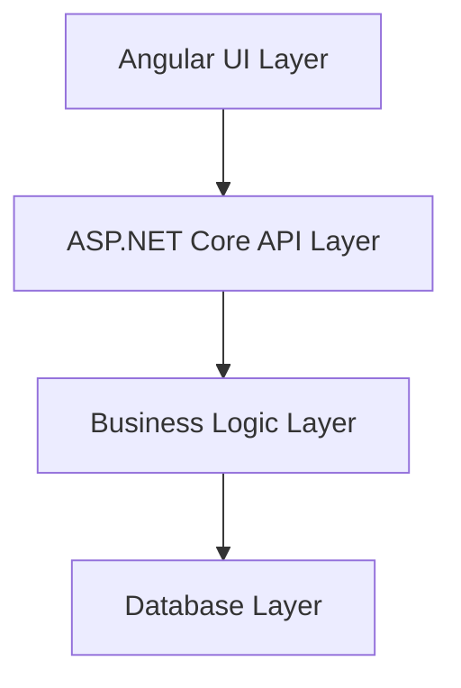
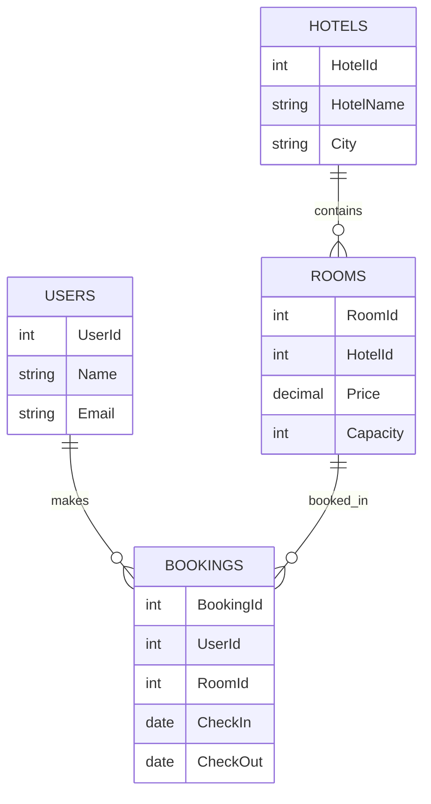
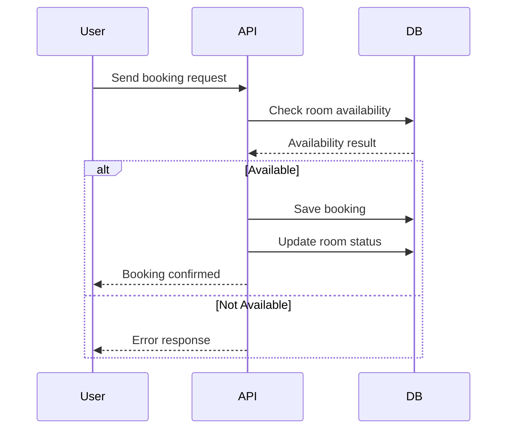

#  StayEase – Smart Hotel Booking System

> A Full-Stack Hotel Booking Platform built with **ASP.NET Core + Angular**  
> Designed for scalability, performance, and real-world business workflows.

---

##  Project Vision

StayEase aims to simplify hotel booking by providing a seamless platform where users can:

✔️ Browse hotels & rooms  
✔️ Check real-time availability  
✔️ Book rooms instantly  
✔️ Manage bookings efficiently  

---

##  System Flow (High Level)

```mermaid
flowchart LR
    A[User] --> B[Angular Frontend]
    B --> C[ASP.NET Core API]
    C --> D[Business Logic Layer]
    D --> E[Entity Framework Core]
    E --> F[(SQL Server DB)]
````

---

##  Booking Flow (Core Logic)

```mermaid
flowchart TD
    A[Search Hotels] --> B[Select Room]
    B --> C[Enter Booking Details]
    C --> D[Check Availability]
    D -->|Available| E[Calculate Price]
    E --> F[Create Booking]
    F --> G[Update Room Availability]
    G --> H[Return Confirmation]
    
    D -->|Not Available| X[Show Error]
```

---

##  Core Features

### 🔹 Customer Features

* Hotel & Room Browsing
* Filter by Location / Price / Availability
* Booking System
* Booking Status Tracking

### 🔹 Backend Features

* RESTful APIs
* Code First Database Design
* Business Logic Validation
* Swagger & Postman Testing

---

##  Tech Stack

### Backend

* ASP.NET Core Web API (.NET 6)
* Entity Framework Core
* SQL Server

### Frontend

* Angular
* TypeScript
* HTML / CSS

### Tools

* Swagger
* Postman
* GitHub
* Visual Studio / VS Code

---

##  Architecture Overview



---

##  Database Design

###  Tables

* Users (Customers)
* Hotels
* Rooms
* Bookings
* Amenities

---

###  Relationships



---

##  API Structure

###  Hotels

* `GET /api/hotels` → Fetch all hotels
* `GET /api/hotels/{id}` → Get hotel details
* `POST /api/hotels` → Add hotel
* `PUT /api/hotels/{id}` → Update hotel
* `DELETE /api/hotels/{id}` → Delete hotel

---

###  Rooms

* `GET /api/rooms` → Fetch all rooms
* `GET /api/rooms/{id}` → Get room
* `GET /api/rooms/hotel/{hotelId}` → Rooms by hotel
* `GET /api/rooms/available` → Available rooms
* `POST /api/rooms` → Add room
* `PUT /api/rooms/{id}` → Update room
* `DELETE /api/rooms/{id}` → Delete room

---

###  Bookings

* `GET /api/bookings` → All bookings
* `GET /api/bookings/{id}` → Booking details
* `GET /api/bookings/customer/{id}` → Customer bookings
* `POST /api/bookings` → Create booking
* `PUT /api/bookings/{id}` → Update booking
* `PUT /api/bookings/{id}/cancel` → Cancel booking

---

###  Amenities

* `GET /api/amenities` → List amenities
* `POST /api/amenities` → Add amenity
* `PUT /api/amenities/{id}` → Update
* `DELETE /api/amenities/{id}` → Remove

---

##  Booking Execution Logic



---

##  Run the Project

### Backend

```bash
cd WebApplication1
dotnet restore
dotnet run
```

---

### Frontend

```bash
cd frontend
npm install
ng serve
```

Open:

```
http://localhost:4200
```

---

##  Database Setup (Code First)

```bash
Add-Migration InitialCreate
Update-Database
```

---

##  Testing

* Swagger UI → Auto-loaded
* Postman → Use API endpoints

---

##  Future Enhancements

* JWT Authentication 
* Role-based Authorization
* Payment Gateway
* Email Notifications
* Booking Calendar
* AI-based Recommendations

---

##  Key Learnings

* Full Stack Development (.NET + Angular)
* REST API Design
* Entity Framework Core
* Code First Approach
* Real-world system architecture
* Team Collaboration using Git

---

##  Team Singularity

**Team Name:** *Singularity* 

###  Members

* Pranav Shukla
* Kushagra Chandel
* Preeti Singh
* Agrima Chaturvedi

---

##  Final Note

This project demonstrates a **real-world scalable booking system** with clean architecture, modular design, and extensibility for enterprise use.

---

## 🔗 Repository

 [https://github.com/impranavshukla/HCL-Fullstack-Project](https://github.com/impranavshukla/HCL-Fullstack-Project)


